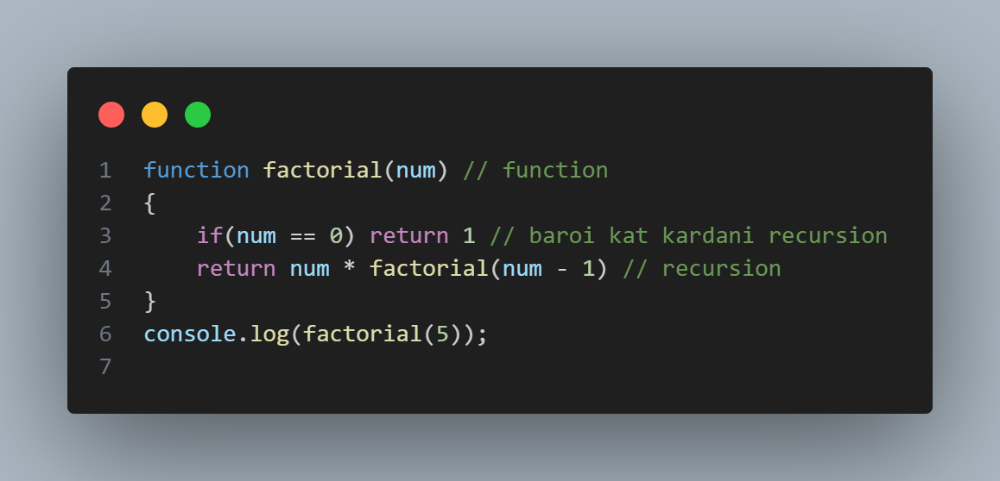
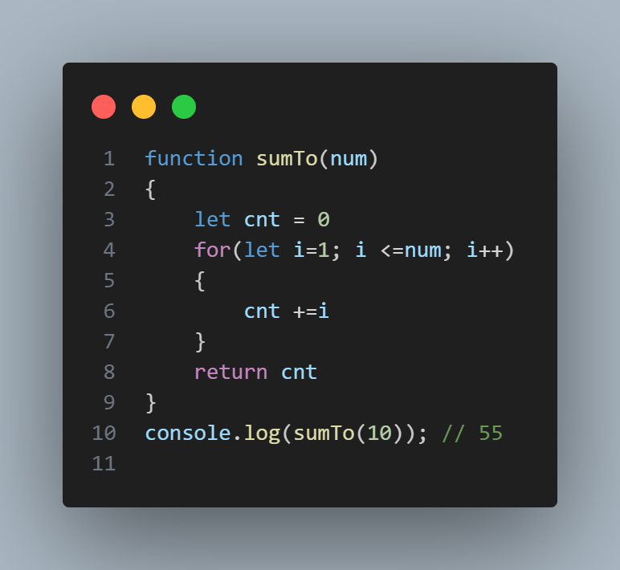
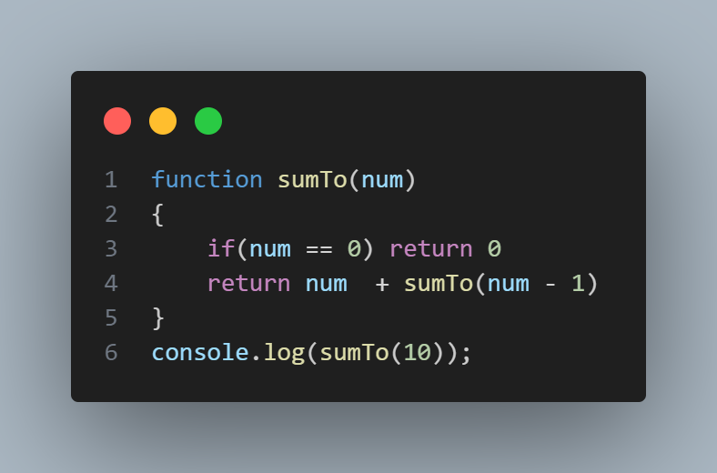
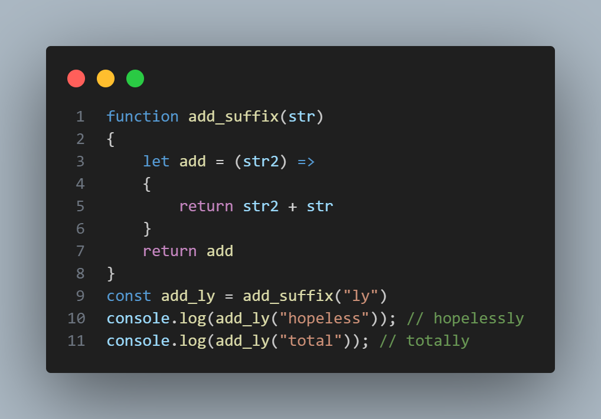

# RECURSION 

# Рекурсия дар барномасозӣ мисли функсияе мебошад, ки худашро пайваста фаро мехонад. Вақте ки функсия чунин амал мекунад, онро функсияи рекурсивӣ меноманд.

# Аммо қоидае ҳаст, ки бояд риоя шавад: он бояд роҳи қатъ кардани фаро хондани худро дошта бошад, вагарна он то абад идома меёбад. Ин қоидаи қатъкунандаро ҳолати асосӣ меноманд.

# Example

# Рекурсия барои осон кардани коди мо истифода бурда мешавад 
# Example

# Мисол барои суммаи аз рақами 1 то рақами 10 ёфтанро бе рекурсия коди мо ҳамин кадар мешавад
# Ва агар мо ҳамин  мисолро бо рекурсия кор кунем коди мо хело кутоҳ мешавад.

---
---
---

# CLOSURE
# Closure ин омезиши функсия бо истинодҳои ҳолати иҳотаи он (муҳити лексикӣ) мебошад. Ба ибораи дигар, closure ба шумо имкон медиҳад, ки аз дохили функсияи дохилӣ ба муҳити функсияи берунияш дастрасӣ пайдо кунед.

# Дар мисоли зерин closure кор мекунад ки дар калимаҳои hopeless & total суфикси "ly" - ро илова мекунад.

# Барои маълумоти бештар гирифтан ба [линки](https://www.canva.com/design/DAGVgq52SsU/1akpcYxOZdLt57P5dGJ_kQ/view?utm_content=DAGVgq52SsU&utm_campaign=designshare&utm_medium=link&utm_source=editor) зерин пахш кунед